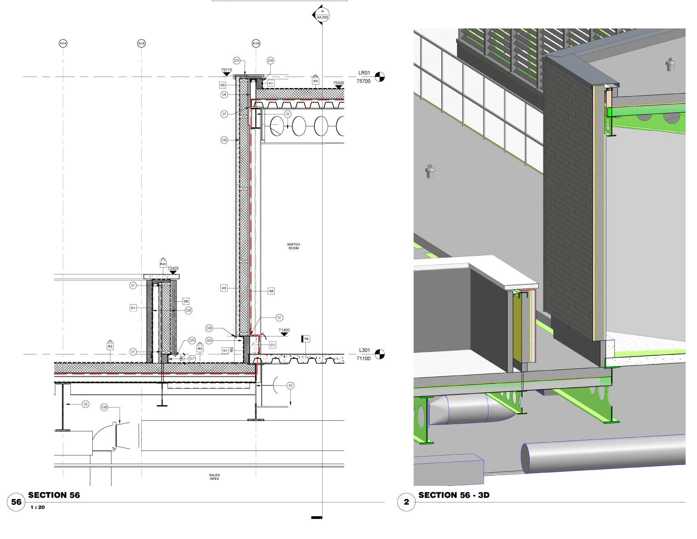
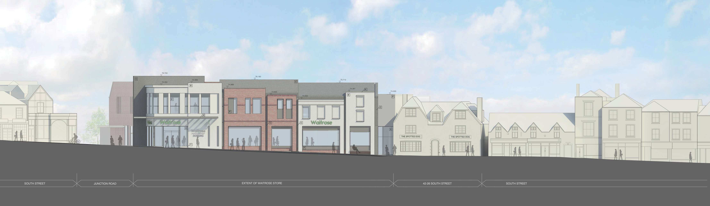
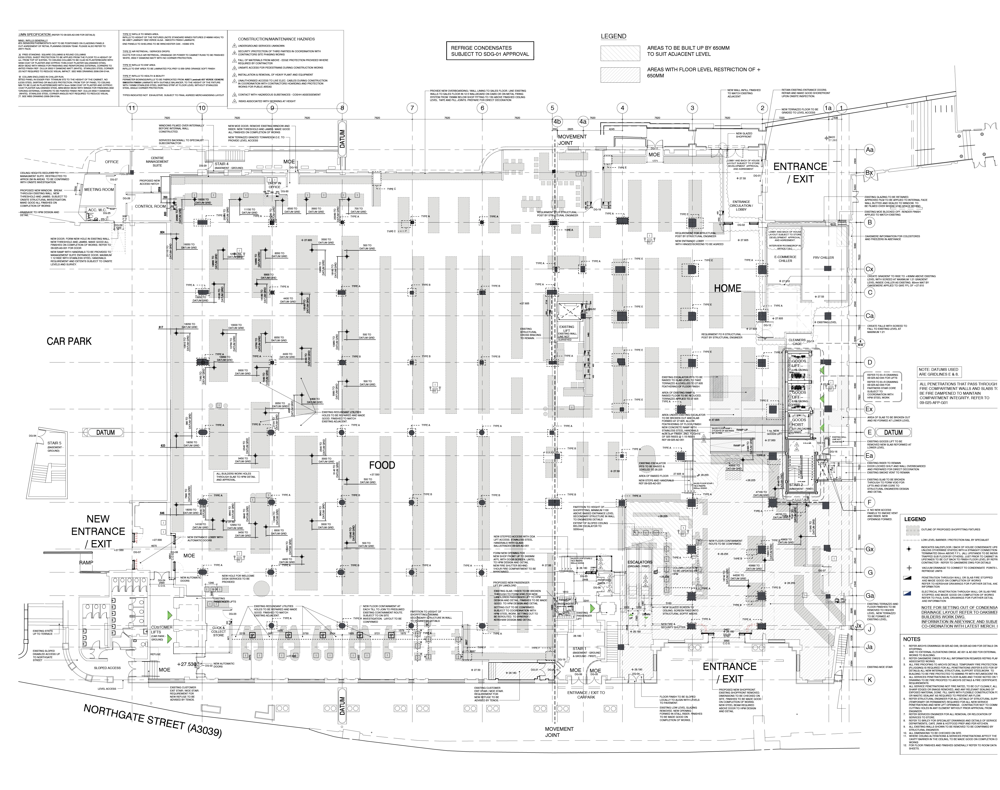

<link href="style.css" rel="stylesheet">
# Architectural Portflio 

## Archilogic • Product Manager • *11/2022 - Present*  
### Editor 4.0
### Spacegraph Data Model 
### BOMA Calculatior
### IWMS intergrations 
### CAD Imports 
### IFC Exports 
### GLTF 

## WeWork • Product Manager, Design Technology • *07/2018 - 12/2022*
### Record Model initiative
### Design Standards
### entreprise AMAZON Manchester 
### Reality Capture
### PyRevit Tools
### Dynamo Tools 

## Pascall + Watson • Building Information Model Coordinator • *11/2016 - 07/2018*
### Campus overview
#### Unique Challanges
#### Model Overview 
### DATCT 
### Planning Set
### COBie and Uniclass 
### Dynamo 

## Watkins Gray International • Building Information Model Manager • *02/2014 - 11/2016*
### Seven Kings Redbridge 
### Abacus Belsize Primary School 
### Housing Audits 
### Bromley South Central Detailing 
### GOSH Int. Private Patients Wing

## 1508 London • Architectural Technologist • *11/2012 - 02/2014*
### BEBEK
### Draper 
### Detailing examples 

## B+R Architects • Architectural Technologist • *08/2010 - 11/2012*
### Waitrose Dorking

### JLP Leeds

=============
<!--- 
 
--->

end of page

