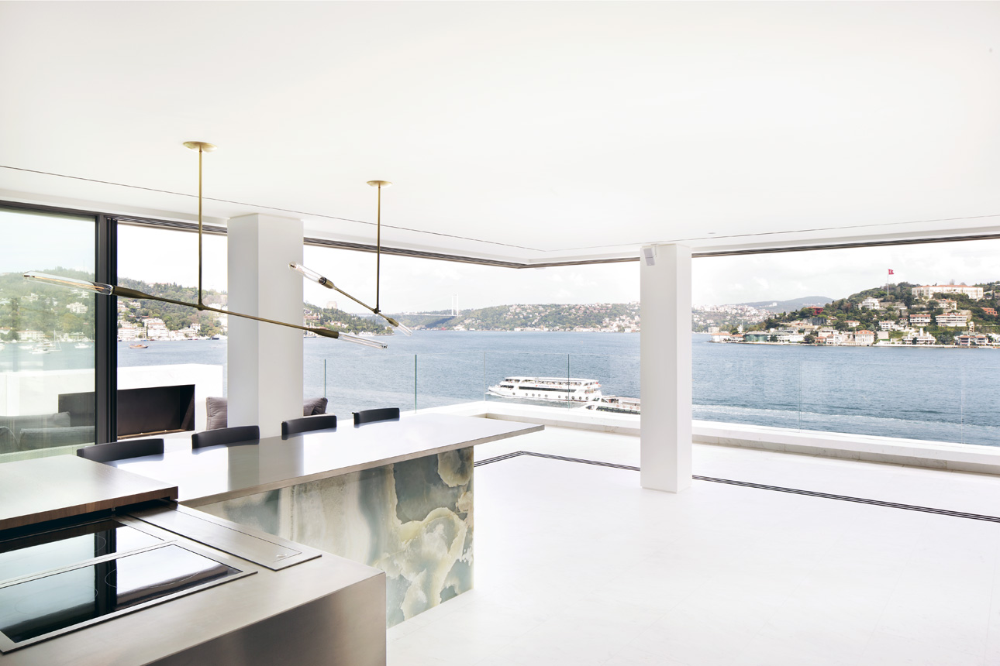
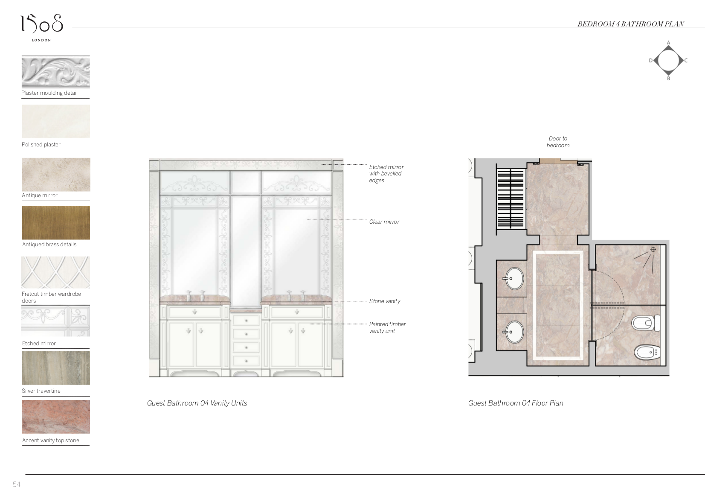
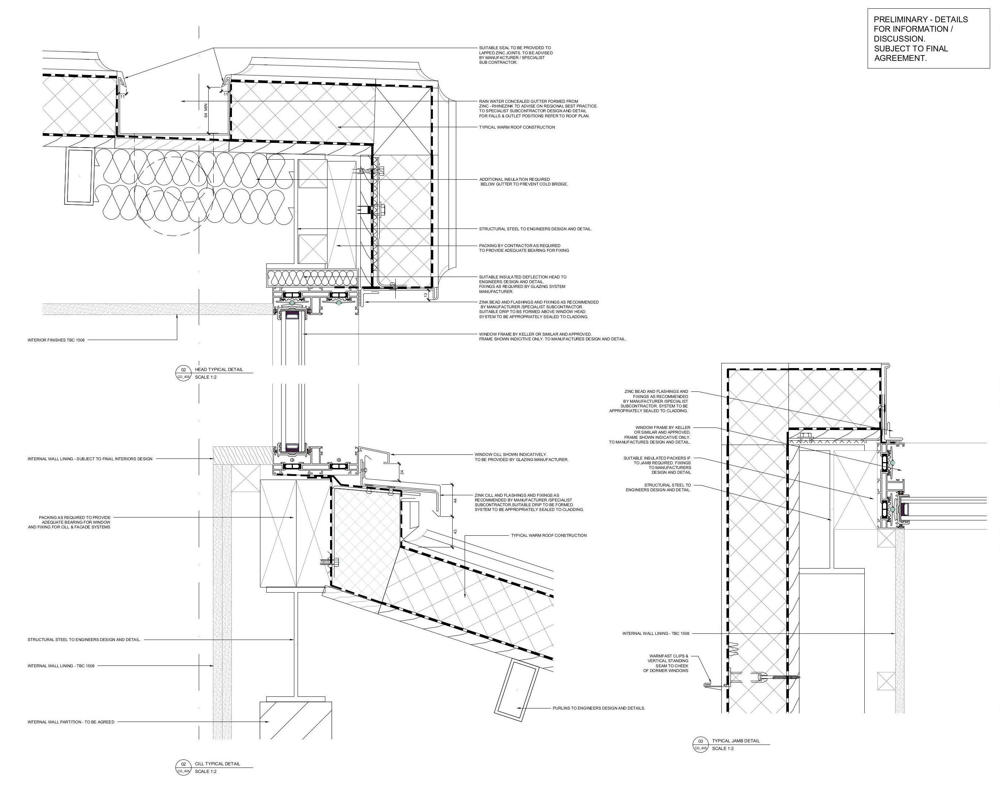
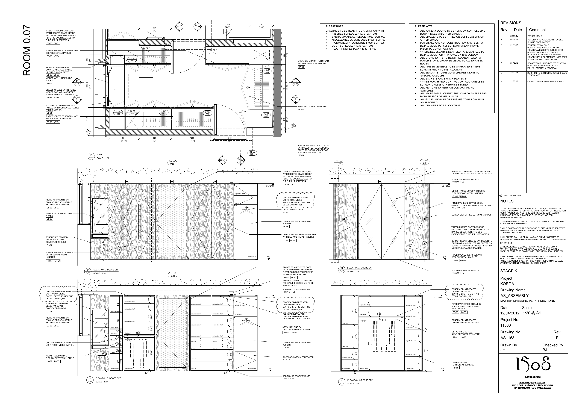
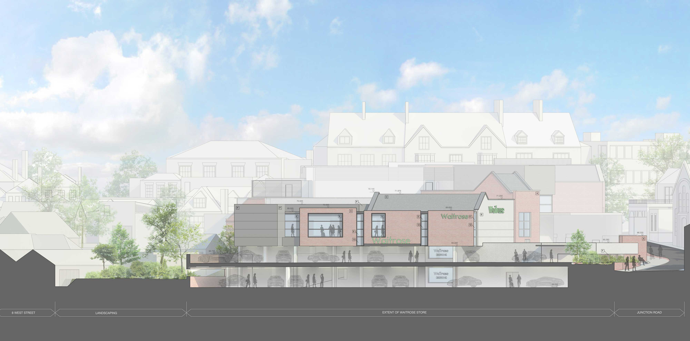
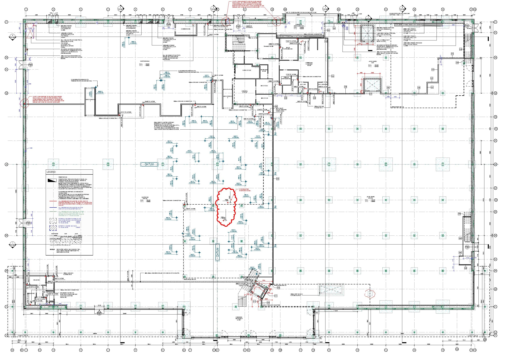

<link href="style.css" rel="stylesheet">
# Architectural Portflio 

## Archilogic • Product Manager • *11/2022 - Present*  
### Editor 4.0
### Spacegraph Data Model 
### BOMA Calculatior
### IWMS intergrations 
### CAD Imports 
### IFC Exports 
### GLTF 

## WeWork • Product Manager, Design Technology • *07/2018 - 12/2022*
### Record Model initiative
### Design Standards
### entreprise AMAZON Manchester 
### Reality Capture
### PyRevit Tools
### Dynamo Tools 

## Pascall + Watson • Building Information Model Coordinator • *11/2016 - 07/2018*
### Campus overview
#### Unique Challanges
#### Model Overview 
### DATCT 
### Planning Set
### COBie and Uniclass 
### Dynamo 

## Watkins Gray International • Building Information Model Manager • *02/2014 - 11/2016*
> Watkins Gray International LLP is a distinguished architecture and design firm dedicated to enhancing lives through innovative and sustainable building solutions. Specializing in sectors such as education, healthcare, residential, commercial, and defense, their expertise spans diverse project types. Committed to the art and science of building, Watkins Gray International LLP combines creativity with technical precision to deliver transformative spaces that meet the evolving needs of clients.
### Seven Kings Redbridge

### Housing Audits 

### Bromley South Central Detailing

### GOSH Int. Private Patients Wing

### Other Projects

#### Office Rapid Prototype, Leeds

#### Residential units in tower and bar building, London

## 1508 London • Architectural Technologist • *11/2012 - 02/2014*
> 1508 London is an esteemed design studio renowned for crafting exceptional interiors and architectural spaces. Specializing in bespoke residential, hospitality, and yacht projects, they blend timeless elegance with innovative design. Their portfolio includes iconic developments like No.1 Grosvenor Square and the Mandarin Oriental Residences. With a tailored approach and a dedication to excellence, 1508 London transforms client visions into luxurious, functional realities.

### Bebek
This project in Istambul overlooking the Bebek inspired insluded a full rebuild of the roof structure to create a 2nd floor for this stunning view. many tecnhicial chalanges included 36m of continious, electronic curtains. 

### Beverly
This project was a home in dubai, which no stone was unturned to achieve the vision of the team.

### Detailing examples 
Out technical philosophy in 1508 was that if you can touch it, you should draw it. We deliveded the ultimate finish quality by drawing every touch point, detail and corner at a 1:1, 1:2 or 1:5 scale. 

## B+R Architects • Architectural Technologist • *08/2010 - 11/2012*
> B+R Architects excels in delivering top-tier architectural solutions, emphasizing innovation, sustainability, and functionality. With expertise in Building Information Modeling (BIM) and a diverse portfolio, they cater to sectors including commercial, retail, and mission-critical facilities. Their commitment to design excellence is evident in projects like Google HQ and Waitrose John Lewis. At B+R Architects, creativity meets technology to transform spaces and exceed client expectations.
### Waitrose Dorking

### JLP Leeds

=============

