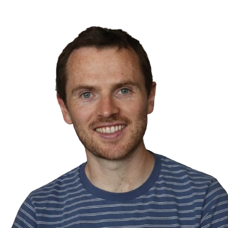

<link href="style.css" rel="stylesheet">

  <!-- 
 
    <!-- 

 -->
  

    
  

  
# 👋 Hello

I'm Eimhin Rafferty

I am a Product Manager with 5+ years as a PM and 10+ in Design and Construction. I have lead large and successful initiatives and fostered user-centric design. I possess strong user empathy, an eye for good design, and a continuous curiosity to drive product improvements. My Architectural background gives me a meticulous attention to detail and strong problem-solving skills.

## About Me
- 🏃 I love to Cycle & Run -> Follow me on  [Strava](https://www.strava.com/athletes/eimhin_rafferty)  
- 🚸 Most of my time is spend being a dad though!
- 🇮🇪 I'm from ireland
- 🇬🇧 I've Lived and worked for many years in the UK
- 🇮🇹 Now I live in Italy with my family
- 🔉 Eimhin is a difficult irish name, it is prounced like 'Kevin' if you ignore the K

## Contact

you can drop me an email any time, whatsapp, signal or telegram too.
or find me anywhere below:

 [Github](https://www.github.com/eimhinr)
[LinkedIn](https://www.linkedin.com/eimhin-rafferty)

