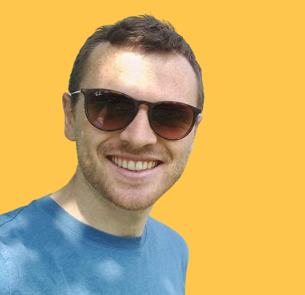

---
title: "Eimhin Rafferty"
image: "../assets/profile.png"
--- 

  

👋 Hello

I'm Eimhin.

I work for Autodesk, on the Tandem Team. Ask me about Digital Twins!

My background is in Architecture Technology, and have worked on projects big and small, over a decade in London, before moving into Product Manageemt and Customer Sucess roles in the tech world.

## About Me
- 🏃 I love to Cycle & Run ↗️ Follow me on ⏱️ [Strava](https://www.strava.com/athletes/eimhin_rafferty)  
- 🚸 Most of my time is spend being a dad though!
- 🇮🇪 I'm from ireland
- 🇬🇧 I've Lived and worked for many years in the UK
- 🇮🇹 Now I live in Italy with my family
- 🔉 Eimhin is a difficult irish name, it is prounced like 'Kevin' if you drop the K 

## Contact

you can drop me an email any time, whatsapp, signal or telegram too.
or find me anywhere below:

💻 [Github](https://www.github.com/eimhinr)

📋 [LinkedIn](https://www.linkedin.com/in/eimhin-rafferty)
